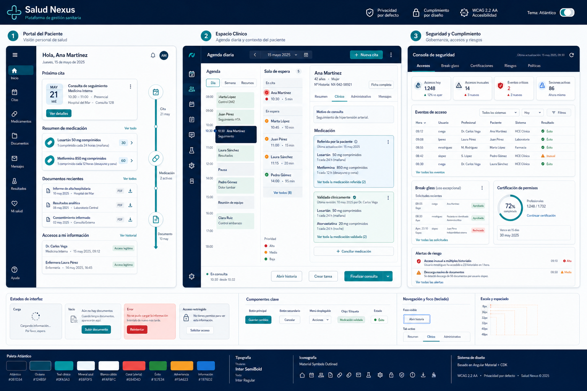

<p align="center">
  <picture>
    <source media="(prefers-color-scheme: dark)">
    
  </picture>
</p>

<h1 align="center">Salud Nexus</h1>

<p align="center">
  Plataforma modular de gestión sanitaria — paciente, profesionales, recepción y cumplimiento
</p>

<p align="center">
  <a href="LICENSE"></a>
  
  
  
  
  
  
  
  
</p>

---

## ¿Qué es Salud Nexus?

Sistema de gestión sanitaria **para un único centro médico por despliegue**. Cubre de extremo a extremo identidad, pacientes, agendas, citas, medicación informativa, documentos, privacidad, auditoría y administración, sin ser una historia clínica integral ni realizar diagnóstico o prescripción autónoma.

La seguridad, privacidad y trazabilidad **no son extras**: están en el ADN del diseño desde el día uno, con requisitos trazables a OWASP ASVS 5.0 nivel 3 y WCAG 2.2 AA.

> ⚠️ **Datos exclusivamente sintéticos.** No utilizar con datos sanitarios reales hasta completar configuración organizativa, EIPD, hardening, pentest y autorización de producción.

---

## Arquitectura

```
┌─────────────────────────────────────────────────────────┐
│                  Angular 22 Workspace                    │
│   patient-portal  │  staff-portal  │  design-lab        │
│          │               │               │              │
│     ┌────┴───────────────┴───────────────┴────┐         │
│     │           api-client (OpenAPI 3.1)       │         │
│     └────────────────────┬────────────────────┘         │
├──────────────────────────┼──────────────────────────────┤
│               Laravel 13 Modular Monolith               │
│                                                         │
│  Identity · Organizations · Patients · Scheduling       │
│  Medication · Documents · Notifications · Privacy       │
│  Audit (append-only + hash chain)                       │
│                                                         │
│  Shared: PublicIdGenerator · ClockInterface · Health     │
│  Support: LogSanitizer · ProblemDetails · DB Helpers     │
├─────────────────────────────────────────────────────────┤
│  PostgreSQL 18  │  Redis 8  │  Object Storage (S3)      │
│  SCRAM-SHA-256  │  AOF      │  Server-side encryption   │
└─────────────────────────────────────────────────────────┘
```

> 🔗 [Diagrama interactivo completo](.freebuff/architecture-diagram.html) — 7 secciones navegables con todos los módulos, conexiones, flujos y esquema DB.

### Stack tecnológico

| Capa | Tecnología | Versión |
|---|---|---|
| **Backend** | Laravel (PHP) | 13.x / 8.3+ |
| **Frontend** | Angular + Material/CDK | 22.x / TS 6.0 strict |
| **API** | REST + OpenAPI | 3.1 |
| **Base de datos** | PostgreSQL | 18 (Alpine) |
| **Cache / Colas / Sesiones** | Redis | 8 (Alpine) |
| **Documentos** | Object Storage | S3-compatible |
| **Auth** | Sanctum BFF + TOTP + OIDC ports | Cookie HttpOnly |
| **Auditoría** | Hash chain SHA-256 | Append-only |
| **Testing** | PHPUnit 12 · Vitest 4 · Playwright | — |
| **CI/CD** | GitHub Actions · Docker Compose | Containers hardened |

### Módulos del backend (9)

| Módulo | Estado | Responsabilidad |
|---|---|---|
| **Identity** | ✅ Activo | Sesiones BFF, MFA TOTP, OIDC port |
| **Organizations** | ⏳ Stub | Centro único, unidades, recursos |
| **Patients** | ✅ Activo | Ficha, portal link, dashboard, perfil |
| **Scheduling** | ✅ Activo | Disponibilidad, booking idempotente, cancelación versionada |
| **Medication** | ✅ Activo | Registro + declaraciones, conciliación, renovación |
| **Documents** | ✅ Activo | PDF, hash, publicación, grants de descarga efímera |
| **Notifications** | ⏳ Stub | Outbox transaccional, multi-canal |
| **Privacy** | ⏳ Stub | Derechos ARCO, consentimientos, break-glass |
| **Audit** | ✅ Activo | Append-only, hash chain verificable |

---

## Inicio rápido

### Frontend (Angular)

```powershell
cd frontend
npm ci

# Arrancar los portales
npm run start:patient   # http://localhost:4200
npm run start:staff     # http://localhost:4201
npm run start:design    # http://localhost:4300 (mockups y catálogo visual)
```

### Backend (Laravel)

```powershell
cd backend
composer install
cp .env.example .env
php artisan key:generate
php artisan migrate --force
php artisan serve        # http://localhost:8000
```

### Stack completo (Docker)

```powershell
# Arranca PostgreSQL, Redis, API, NGINX proxy y portales
powershell -File scripts/Start-Local.ps1

# Con design-lab y workers
powershell -File scripts/Start-Local.ps1 -IncludeDesignLab -IncludeWorkers
```

URLs disponibles:

| Servicio | URL |
|---|---|
| **API** | `http://127.0.0.1:8080/api/v1` |
| **Paciente** | `http://127.0.0.1:4200` |
| **Profesionales** | `http://127.0.0.1:4201` |
| **Design Lab** | `http://127.0.0.1:4300` |

---

## Quality gates

Cada cambio se verifica con puertas de calidad automatizadas:

### Frontend

```powershell
npm run verify    # api:check → format:check → lint → test:unit → build → test:e2e → audit
npm run lint
npm run test:unit
npm run test:e2e
```

### Backend

```powershell
composer verify   # format → analyse → test → openapi → security-audit → validate
composer format
composer analyse
php artisan test
```

### Infraestructura

```powershell
powershell -File scripts/Test-Infrastructure.ps1
powershell -File scripts/Verify-Workspace.ps1 -ComposerPath composer
```

---

## Contrato OpenAPI y cliente generado

El contrato autoritativo está en [`backend/openapi/openapi.json`](backend/openapi/openapi.json). El cliente Angular se genera con [Orval](https://orval.dev/) y **nunca se edita manualmente**.

```powershell
cd frontend
npm run api:lint       # Valida OpenAPI con reglas estrictas (Redocly)
npm run api:generate   # Genera el cliente en projects/api-client/src/lib/generated
npm run api:check      # Lint + verifica que el cliente no tenga derivas
```

---

## Principios de seguridad

- **Sesiones BFF**: cookies `HttpOnly` + `Secure` + `SameSite`. Sin JWT en `localStorage`.
- **Deny-by-default**: autorización en backend con RBAC + ABAC + relación asistencial + finalidad + ámbito.
- **Auditoría inmutable**: append-only con encadenamiento criptográfico SHA-256 verificable.
- **Minimización de datos**: cada rol ve solo lo necesario. Logs sanitizados (sin PHI, tokens ni secretos).
- **Datos sintéticos**: cero datos reales en Git, fixtures, capturas, logs o telemetría.
- **Docker hardening**: `no-new-privileges`, `cap_drop ALL`, `read_only` rootfs, tmpfs, CPU/MEM/PID limits.
- **PostgreSQL**: SCRAM-SHA-256, data-checksums, restricciones compuestas tenant-safe.
- **Idempotencia**: todas las mutaciones con clave de idempotencia y detección de replay.

---

## Estructura del repositorio

```text
backend/            Laravel 13 — API REST, módulos DDD y OpenAPI 3.1
  app/Modules/      9 dominios: Identity, Organizations, Patients, Scheduling,
                    Medication, Documents, Notifications, Privacy, Audit
  tests/            Unitarias, feature, arquitectura e integración
  database/         8 migraciones con 28+ tablas + factories

frontend/           Angular 22 workspace
  projects/
    patient-portal/   Portal del paciente (móvil-first, WCAG AA)
    staff-portal/     Portal de profesionales y recepción
    design-lab/       Catálogo visual con todos los mockups y estados
    design-system/    SnIcon, SnStatusChip, SnMetricCard, tokens
    api-client/       Cliente HTTP generado desde OpenAPI
    auth/             SessionAuth, sessionExpiryInterceptor
    motion/           ScrollReveal, GSAP (matriz de propósito)
    shared/           parsePublicId, validaciones, guards

docs/               Producto, arquitectura, diseño, ADRs y seguridad
tasks/              Backlog trazable (16 temas) + evidencias de cortes
infrastructure/     Docker Compose endurecido + NGINX + secretos
scripts/            Start-Local, Test-Infrastructure, Verify-Workspace
```

---

## Documentación

| Documento | Descripción |
|---|---|
| [`docs/specification.md`](docs/specification.md) | Especificación de producto completa |
| [`docs/source/plan-maestro.md`](docs/source/plan-maestro.md) | Plan maestro (capítulos 1–35) |
| [`docs/decisions/`](docs/decisions/) | 12 ADRs: monolito, Angular CLI, sesiones BFF, PostgreSQL, OpenAPI, Signals, auditoría, Material/CDK, motion, identificadores, centro único, descargas |
| [`tasks/plan.md`](tasks/plan.md) | Plan de implementación con fases y cortes verificados |
| [`tasks/backlog/`](tasks/backlog/) | 16 archivos de backlog temático |
| [`infrastructure/README.md`](infrastructure/README.md) | Guía de infraestructura y hardening |
| [`.freebuff/architecture-diagram.html`](.freebuff/architecture-diagram.html) | Diagrama interactivo completo |

---

## Estado del proyecto

**Fase actual:** v0.5 pre-production. Núcleo de identidad, pacientes, scheduling, medicación, documentos y auditoría implementados con pruebas. Notifications, Privacy y Organizations son stubs operativos.

Próximos hitos:
- 🔜 MFA TOTP + AAL2 (en progreso)
- 🔜 Notificaciones outbox multi-canal
- 🔜 Integración OIDC real
- 🔜 EIPD y documentación de cumplimiento

---

## Licencia

MIT © 2026 — Este proyecto no está afiliado a ninguna entidad sanitaria real. Todos los datos son sintéticos.

---

<p align="center">
  <sub>🤖 Generado con Codebuff · Co-Authored-By: Codebuff <noreply@codebuff.com></sub>
</p>
